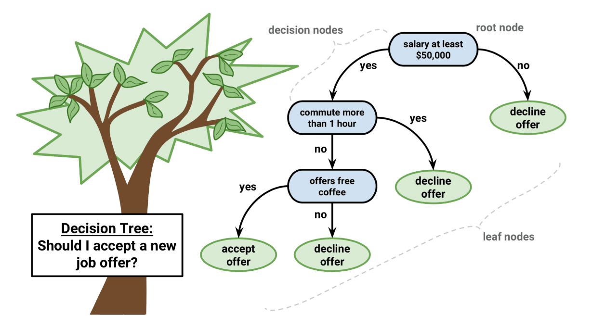
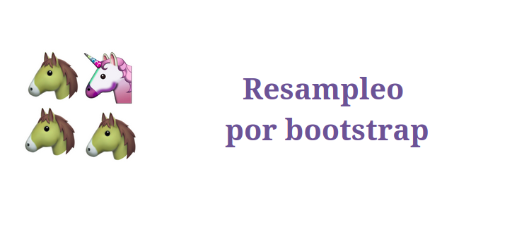
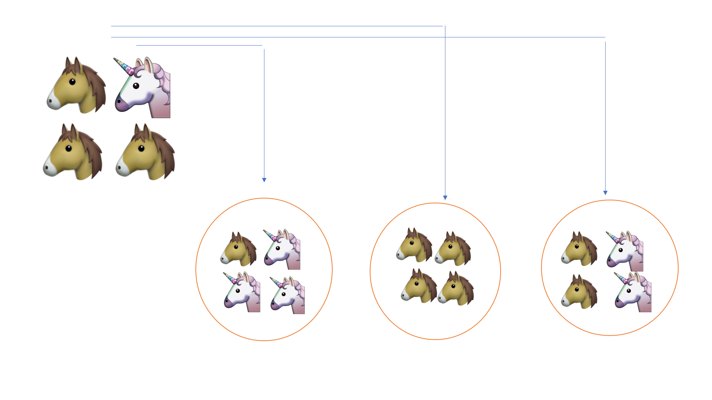
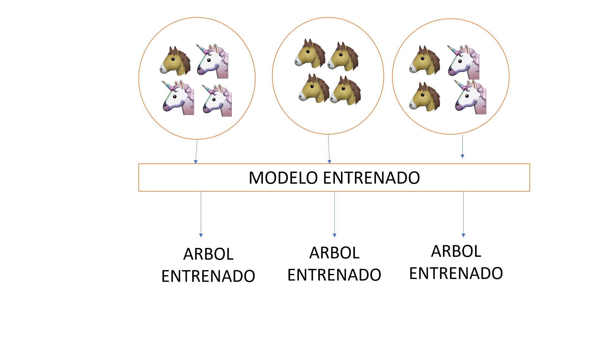
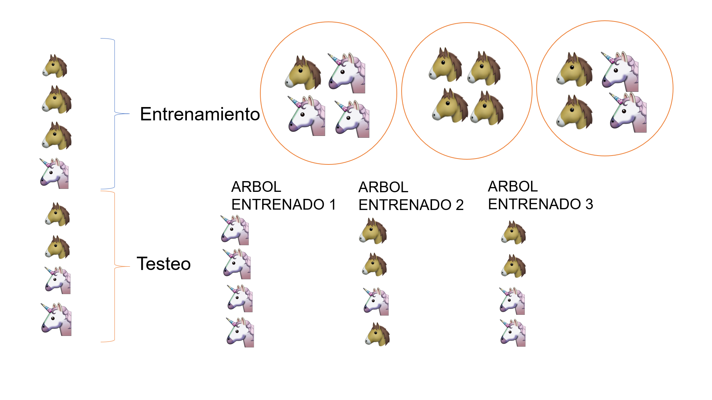
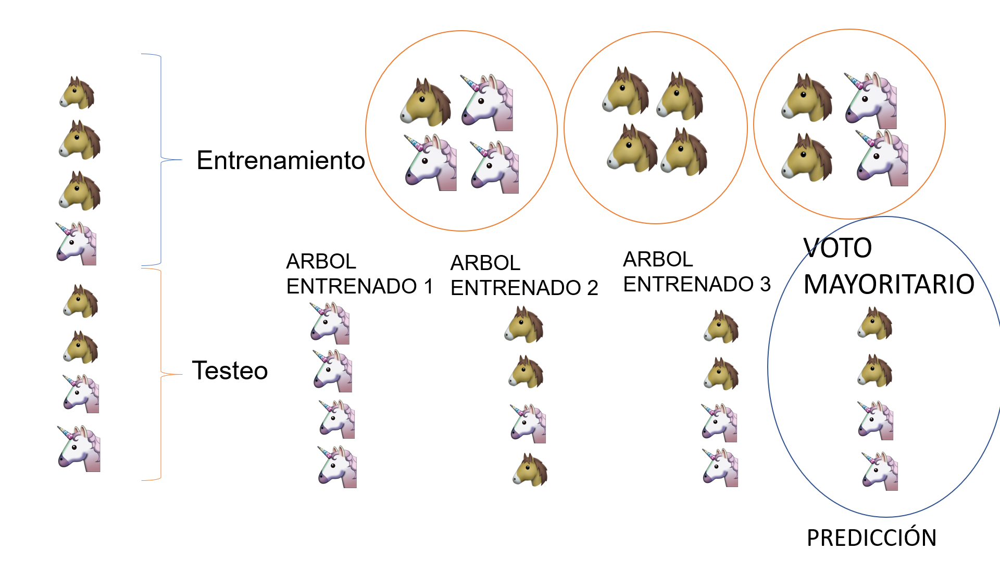

---
output:
  xaringan::moon_reader:
    lib_dir: libs
    css: xaringan-themer.css
    nature:
      highlightStyle: github
      highlightLines: true
      countIncrementalSlides: false
---

background-image: url(img/latinR-portada.png)
background-size: cover
class: animated slideInRight fadeOutLeft, middle

```{r xaringan-extra-styles, include=FALSE}
xaringanExtra::use_extra_styles(
  hover_code_line = TRUE,         #<<
  mute_unhighlighted_code = TRUE  #<<
)
```


```{r , echo=FALSE}
xaringanExtra::use_tachyons()
xaringanExtra::use_panelset()
```


```{r include=FALSE}
library(countdown)
```

```{r setup, include=FALSE}
options(htmltools.dir.version = FALSE)
```

```{r xaringan-themer, include=FALSE, warning=FALSE}
library(xaringanthemer)
style_duo_accent(
  primary_color = "#5542FF",
  secondary_color = "#5542FF",
  inverse_header_color = "#FFFFFF"
)

style_duo_accent(
  header_font_google = google_font("Montserrat", "500"),
  text_font_google   = google_font("Montserrat", "400", "300i"),
  code_font_google   = google_font("Montserrat")
)
```

```{r , message=FALSE, warning=FALSE, include=FALSE} 
library(fontawesome)
library(emo)
```


```{r xaringan-logo, echo=FALSE}
xaringanExtra::use_fit_screen()
xaringanExtra::use_logo("img/logo-tidymodels.png")
```


```{r xaringan-tachyons, echo=FALSE}
xaringanExtra::use_tachyons()
xaringanExtra::use_fit_screen()
```


# 02. Clasificación. Tuneo de Modelos. 


---

background-image: url(img/latinR-portada.png)
background-size: cover
class: animated slideInRight fadeOutLeft, middle


# Árboles de decisión


---

# Árboles de decisión

  
```{r echo=FALSE, out.width = '100%',  fig.align='center'}

```


.footnote[Imagen tomada de https://www.packtpub.com/big-data-and-business-intelligence/machine-learning-r-second-edition]

---

## Hiperparámetro


.bg-near-white.b--purple.ba.bw2.br3.shadow-5.ph4.mt5[
### Un hiperparámetro es una propiedad de un algoritmo de aprendizaje. Este valor influencia la forma en que trabaja el algoritmo. Estos valores no son aprendidos por el algoritmo desde los datos. Deben ser seteados antes de correr el algoritmo por el analista. 
]


.footnote[The Hundred-page machine learning book. Andriy Burkov]


---

## Hiperparámetros de 
## árboles de decisión

* **min_n**

Establezca n mínimo para dividir en cualquier nodo.
Es un método de parada temprana. Se utiliza para evitar el sobreajuste.

* **tree_depth**

Pone un límite a la profundidad máxima del árbol.
Un método para detener el algoritmo. Se utiliza para evitar el sobreajuste.

* **cost_complexity**

Agrega un costo o penalización a los errores de árboles más complejos. 
Es una forma de poda. Utilizado para evitar el sobreajuste (overfitting).

---

## Vamos a modelar las especies `r emo::ji("penguin")`

### Ingreso los datos 
```{r message=FALSE, warning=FALSE}
library(tidymodels) 
library(palmerpenguins)

penguins <- palmerpenguins::penguins %>%
  drop_na() %>% #elimino valores perdidos
  select(-year,-sex, -island) #elimino columnas q no son numéricas
glimpse(penguins) #observo variables restantes
```


---

### Paso 1: Vamos a dividir el set de datos 

```{r split, cache=TRUE}
library(rsample)
set.seed(123) #setear la semilla
p_split <- penguins %>%
  initial_split(prop=0.75) # divido en 75%

p_train <- training(p_split)

p_split

# para hacer validación cruzada estratificada
p_folds <- vfold_cv(p_train, strata = species) 
```


Estos son los datos de entrenamiento/prueba/total 

* __Vamos a _entrenar_ con 250 muestras__
* __Vamos a _testear_ con 83 muestras__
* __Datos totales: 333__


---

### Paso 2: Preprocesamiento (receta) 

```{r}
#creo la receta
recipe_dt <- p_train %>%
  recipe(species~.) %>%
  step_corr(all_predictors()) %>% #elimino las correlaciones
  step_center(all_predictors(), -all_outcomes()) %>% #centrado
  step_scale(all_predictors(), -all_outcomes()) %>% #escalado
  prep() 
recipe_dt #ver la receta
```


---
background-image: url(img/dt-fondo.png)
background-size: cover

### Paso 3: Especificar el modelo  `r emo::ji("deciduous_tree")`

__Modelo de árboles de decisión__

__Vamos a utilizar el modelo por defecto__

```{r trees,  cache=TRUE}
#especifico el modelo 
set.seed(123)
vanilla_tree_spec <- decision_tree() %>% #arboles de decisión
  set_engine("rpart") %>% #librería rpart
  set_mode("classification") #modo para clasificar
vanilla_tree_spec
```


---
background-image: url(img/dt-fondo.png)
background-size: cover

### Paso 4: armo el workflow 

```{r}
#armo el workflow
tree_wf <- workflow() %>%
  add_recipe(recipe_dt) %>% #agrego la receta
  add_model(vanilla_tree_spec) #agrego el modelo
tree_wf 
```


---

background-image: url(img/dt-fondo.png)
background-size: cover

### Paso 5: Ajuste de la función

```{r  cache=TRUE}
#modelo vanilla sin tunning
set.seed(123) 
vanilla_tree_spec %>% 
  fit_resamples(species ~ ., 
                resamples = p_folds) %>% 
  collect_metrics() #desanidar las metricas
```


---

background-image: url(img/dt-fondo.png)
background-size: cover

#### Paso 5.1: vamos a especificar 2 hiperparámatros 

```{r cache=TRUE}
set.seed(123) 
trees_spec <- decision_tree() %>% 
  set_engine("rpart") %>% 
  set_mode("classification") %>% 
  set_args(min_n = 20, cost_complexity = 0.1) #especifico hiperparámetros

trees_spec %>%
  fit_resamples(species ~ ., 
                resamples = p_folds) %>% 
  collect_metrics()
```


---

background-image: url(img/dt-fondo.png)
background-size: cover

  
# Ejercicio


.bg-near-white.b--dark-blue.ba.bw2.br3.shadow-5.ph4.mt5[
#### 1. ¿Por qué es el mismo valor obtenido en los dos casos?

#### 2. Dejando fijo el valor de min_n=20, pruebe C=1, C=0.5 y C=0.
#### 3. Dejando fijo el valor de C=0, pruebe min_n 1 y 5.
]


`r countdown(minutes = 5, seconds = 00)`


---

background-image: url(img/dt-fondo.png)
background-size: cover

### Paso 6: Predicción del modelo  `r emo::ji("crystal_ball")`


```{r cache=TRUE}
#utilizamos la funcion last_fit junto al workflow y al split de datos
final_fit_dt <- last_fit(tree_wf,
  split = p_split
)
final_fit_dt %>%
  collect_metrics()
```

      
---

background-image: url(img/dt-fondo.png)
background-size: cover

### Paso 6.1: matriz de confusión 

  
```{r cache=TRUE}
final_fit_dt %>%
  collect_predictions() %>%
  conf_mat(species, .pred_class) #para ver la matriz de confusión
```

--


```{r cache=TRUE}
final_fit_dt %>%
  collect_predictions() %>%
  sens(species, .pred_class) #sensibilidad global del modelo
```


---

background-image: url(img/dt-fondo.png)
background-size: cover

# Ejercicio


.bg-near-white.b--dark-blue.ba.bw2.br3.shadow-5.ph4.mt5[
#### Repetir estos pasos para el modelo de C=0 y min_n=5
]

`r countdown(minutes = 5, seconds = 00)`


---


background-image: url(img/dt-fondo.png)
background-size: cover

## Resumiendo

.left-column[
### Paso 1:
__Dividimos los datos__


* initial_split()


]

.right-column[

```{r echo=FALSE, out.width = '40%',  fig.align='center'}
knitr::include_graphics("img/rsample.png")
```

]


---


background-image: url(img/dt-fondo.png)
background-size: cover


## Resumiendo

.left-column[
### Paso 2:
__Preprocesamiento de los datos__

* step_*()

]

.right-column[

```{r echo=FALSE, out.width = '40%',  fig.align='center'}
knitr::include_graphics("img/recipes.png")
```

]

---


background-image: url(img/dt-fondo.png)
background-size: cover


## Resumiendo

.left-column[
### Paso 3:
__Especificamos el modelo y sus args__

* set_engine()
* mode()

]

.right-column[

```{r echo=FALSE, out.width = '40%',  fig.align='center'}
knitr::include_graphics("img/parsnip.png")
```

]


---

background-image: url(img/dt-fondo.png)
background-size: cover


## Resumiendo

.left-column[
### Paso 4: 
__Armamos el workflow con la receta y el modelo__

* workflow()
* add_recipe()
* add_model()

]

.right-column[

```{r echo=FALSE, out.width = '40%',  fig.align='center'}
knitr::include_graphics("img/workflow.png")
```

]

---


background-image: url(img/dt-fondo.png)
background-size: cover

## Resumiendo

.left-column[
### Paso 5: Tune
__Tuneo de los hiperparámetros__

* last_fit()
]

.right-column[

```{r echo=FALSE, out.width = '40%',  fig.align='center'}
knitr::include_graphics("img/tune.png")
```

]


---


background-image: url(img/dt-fondo.png)
background-size: cover

## Resumiendo

.left-column[
### Paso 6:
__Predicción y comparación de las métricas__

* collect_metrics()
* collect_predictions() + conf_mat()

]

.right-column[

```{r echo=FALSE, out.width = '40%',  fig.align='center'}
knitr::include_graphics("img/yardstick.png")
```

]


---

background-image: url(img/latinR-portada.png)
background-size: cover
class: animated slideInRight fadeOutLeft, middle


# Random Forest


---


# Random Forest

 
```{r echo=FALSE, out.width = '90%',  fig.align='center'}

```


.footnote[Imagen tomada de https://conf20-intro-ml.netlify.com/]

---

# Bootstraping

 
```{r echo=FALSE, out.width = '100%',  fig.align='center'}

```

.footnote[Imagen tomada de https://conf20-intro-ml.netlify.com/]


---

# Bagging
 
```{r echo=FALSE, out.width = '100%',  fig.align='center'}

```


.footnote[Imagen tomada de]

---
### Veamos que sucede al clasificar el conjunto de testeo
 
```{r echo=FALSE, out.width = '100%',  fig.align='center'}

```

.footnote[Imagen tomada de https://conf20-intro-ml.netlify.com/]

---
### Voto mayoritario (majority vote)
 
```{r echo=FALSE, out.width = '100%',  fig.align='center'}

```

.footnote[Imagen tomada de https://conf20-intro-ml.netlify.com/]


---

### Hiperparámetros de 
### random forest
  
### mtry
* El número de predictores a muestrearse en cada split de árbol

--

### min_n
* el número de observaciones necesarias para seguir dividiendo nodos


---
background-image: url(img/rf-fondo.png)
background-size: cover
  
  
### Paso 2: Preprocesamos los datos

```{r cache=TRUE}
p_recipe <- training(p_split) %>%
  recipe(species~.) %>%
  step_corr(all_predictors()) %>%
  step_center(all_predictors(), -all_outcomes()) %>%
  step_scale(all_predictors(), -all_outcomes()) %>%
  prep()
p_recipe
```

---

background-image: url(img/rf-fondo.png)
background-size: cover

### Paso 3: Especificar el modelo
```{r cache=TRUE}
rf_spec <- rand_forest() %>% 
  set_engine("ranger") %>% 
  set_mode("classification")


```

---

### Veamos como funciona el modelo sin tunning
```{r}
set.seed(123)

rf_spec %>% 
  fit_resamples(species ~ ., 
                resamples = p_folds) %>% 
  collect_metrics()
```


---
background-image: url(img/rf-fondo.png)
background-size: cover

## Random Forest con mtry=2  `r emo::ji("wrench")`

```{r cache=TRUE}
rf2_spec <- rf_spec %>% 
  set_args(mtry = 2)

set.seed(123)

rf2_spec %>% 
  fit_resamples(species ~ ., 
                resamples = p_folds) %>% 
  collect_metrics()
```


---
background-image: url(img/rf-fondo.png)
background-size: cover

## Random Forest con mtry=3  `r emo::ji("wrench")`

```{r cache=TRUE}
rf3_spec <- rf_spec %>% 
  set_args(mtry = 3)

set.seed(123)

rf3_spec %>% 
  fit_resamples(species ~ ., 
                resamples = p_folds) %>% 
  collect_metrics()

```


---

background-image: url(img/rf-fondo.png)
background-size: cover

## Random Forest con mtry=4  `r emo::ji("wrench")`

```{r cache=TRUE}
rf4_spec <- rf_spec %>% 
  set_args(mtry = 4)

set.seed(123)
rf4_spec %>% 
  fit_resamples(species ~ ., 
                resamples = p_folds) %>% 
  collect_metrics()
```


---


background-image: url(img/fondo-conceptos.png)
background-size: cover
class: animated slideInRight fadeOutLeft, middle

### En la realidad lo que uno realiza es un tuneo de los hiperparámetros del modelo de manera automática

---
background-image: url(img/rf-fondo.png)
background-size: cover


### Tuneo de hiperparámetros automático `r emo::ji("wrench")`

```{r cache=TRUE}
tune_spec <- rand_forest(
  mtry = tune(),
  trees = 1000,
  min_n = tune()
) %>%
  set_mode("classification") %>%
  set_engine("ranger")
tune_spec
```

---
background-image: url(img/rf-fondo.png)
background-size: cover


## Workflows

```{r cache=TRUE}
tune_wf <- workflow() %>%
  add_recipe(p_recipe) %>%
  add_model(tune_spec)

set.seed(123)
cv_folds <- vfold_cv(p_train, strata = species)
tune_wf
```

---

background-image: url(img/rf-fondo.png)
background-size: cover

### Paralelizamos los cálculos

```{r cache=TRUE, message=FALSE}
doParallel::registerDoParallel()

set.seed(123)
tune_res <- tune_grid(
  tune_wf,
  resamples = cv_folds,
  grid = 20
)

tune_res
```

---

background-image: url(img/rf-fondo.png)
background-size: cover

## Rango de valores para min_n y mtry

```{r echo=FALSE, cache=TRUE}
tune_res %>%
  collect_metrics() %>%
  filter(.metric == "roc_auc") %>%
  select(mean, min_n, mtry) %>%
  pivot_longer(min_n:mtry,
               values_to = "value",
               names_to = "parameter"
  ) %>%
  ggplot(aes(value, mean, color = parameter)) +
  geom_point(show.legend = FALSE) +
  facet_wrap(~parameter, scales = "free_x") +
  labs(x = NULL, y = "AUC")+
  theme_xaringan()

```


---
background-image: url(img/rf-fondo.png)
background-size: cover

## Elijo el mejor modelo `r emo::ji("trophy")`

* Con la función select_best

```{r cache=TRUE}
best_auc <- select_best(tune_res, "roc_auc")

final_rf <- finalize_model(
  tune_spec,
  best_auc
)

final_rf

```


---

background-image: url(img/rf-fondo.png)
background-size: cover

## Valores finales
```{r cache=TRUE}
set.seed(123)
final_wf <- workflow() %>%
  add_recipe(p_recipe) %>%
  add_model(final_rf)

final_res <- final_wf %>%
  last_fit(p_split)

final_res %>%
  collect_metrics()
```


---

background-image: url(img/rf-fondo.png)
background-size: cover

## Matriz de Confusión


```{r cache=TRUE}
final_res %>%
  collect_predictions() %>%
  conf_mat(species, .pred_class)
```


---

background-image: url(img/rf-fondo.png)
background-size: cover

## Ejercicio 3

.bg-near-white.b--dark-blue.ba.bw2.br3.shadow-5.ph4.mt5[
#### Con el set de datos de iris realice una clasificación con random forest. 

]

`r countdown(minutes = 10, seconds = 00)`


---


## Resumiendo

.left-column[
### Paso 2: Recipes
__Preprocesamiento de los datos__
]

.right-column[

```{r echo=FALSE, out.width = '40%',  fig.align='center'}
knitr::include_graphics("img/recipes.png")
```

]

---


## Resumiendo

.left-column[
### Paso 3: Parsnip
__Especificamos el modelo y sus args__
]

.right-column[

```{r echo=FALSE, out.width = '40%',  fig.align='center'}
knitr::include_graphics("img/parsnip.png")
```

]
---


## Resumiendo

.left-column[
### Paso 4: Workflow
__Armamos el workflow con la receta y el modelo__
]

.right-column[

```{r echo=FALSE, out.width = '40%',  fig.align='center'}
knitr::include_graphics("img/workflow.png")
```

]

---

## Resumiendo

.left-column[
### Paso 5: Tune
__Tuneo de los hiperparámetros__

]

.right-column[

```{r echo=FALSE, out.width = '40%',  fig.align='center'}
knitr::include_graphics("img/tune.png")
```

]


---

## Resumiendo

.left-column[
### Paso 6:
__Predicción y comparación de las métricas__
]

.right-column[

```{r echo=FALSE, out.width = '40%',  fig.align='center'}
knitr::include_graphics("img/yardstick.png")
```

]


---

background-image: url(img/rf-fondo.png)
background-size: cover

### Importancia de las variables

* libreria vip

```{r message=FALSE, warning=FALSE, eval=FALSE, cache=TRUE}
library(vip)
set.seed(123)
final_rf %>%
  set_engine("ranger", importance = "permutation") %>%
  fit(species ~ .,
      data = juice(p_recipe)) %>%
  vip(geom = "point")+
  theme_xaringan()
```

---

background-image: url(img/rf-fondo.png)
background-size: cover

### Gráfico 
```{r message=FALSE, warning=FALSE, echo=FALSE, cache=TRUE, fig.width=9}
library(vip)
set.seed(123)
final_rf %>%
  set_engine("ranger", importance = "permutation") %>%
  fit(species ~ .,
      data = juice(p_recipe)) %>%
  vip(geom = "point")+
  theme_xaringan()

```


---

### Ejemplos (un poco) más reales

#### [Tuning random forest hyperparameters with #TidyTuesday trees data](https://juliasilge.com/blog/sf-trees-random-tuning/)

<br><br><br><br>
#### [Hyperparameter tuning and #TidyTuesday food consumption](https://juliasilge.com/blog/food-hyperparameter-tune/)


---

background-image: url(img/biblio.png)
background-size: cover


# Bibliografía


#### Max Kuhn & Julia Silge - [Tidy Modeling (en desarrollo)](https://www.tmwr.org/)

#### Julia Silge's [Personal Blog](https://juliasilge.com/blog/)

#### Max Kuhn & Kjell Johnson - [Feature engineering and Selection: A Practical Approach for Predictive Models](http://www.feat.engineering/)

#### Max Kuhn & Kjell Johnson - Applied Predictive Modeling

#### Documentación de [`tidymodels`](https://www.tidymodels.org/)

#### Alison Hill [rstudio conf](https://conf20-intro-ml.netlify.app/materials/) y [curso virtual](https://alison.rbind.io/post/2020-06-02-tidymodels-virtually/) material

---

background-image: url(img/final-fondo.png)
background-size: cover
class: middle

# Muchas gracias `r emo::ji("robot")`


    


