---
output:
  xaringan::moon_reader:
    lib_dir: libs
    css: xaringan-themer.css
    nature:
      highlightStyle: github
      highlightLines: true
      countIncrementalSlides: false
---

background-image: url(img/latinR-portada.png)
background-size: cover
class: animated slideInRight fadeOutLeft, middle

```{r xaringan-extra-styles, include=FALSE}
xaringanExtra::use_extra_styles(
  hover_code_line = TRUE,         #<<
  mute_unhighlighted_code = TRUE  #<<
)
```


```{r , echo=FALSE}
xaringanExtra::use_tachyons()
xaringanExtra::use_panelset()
```


```{r include=FALSE}
library(countdown)
```

```{r setup, include=FALSE}
options(htmltools.dir.version = FALSE)
```

```{r xaringan-themer, include=FALSE, warning=FALSE}
library(xaringanthemer)
style_duo_accent(
  primary_color = "#5542FF",
  secondary_color = "#5542FF",
  inverse_header_color = "#FFFFFF"
)

style_duo_accent(
  header_font_google = google_font("Montserrat", "500"),
  text_font_google   = google_font("Montserrat", "400", "300i"),
  code_font_google   = google_font("Montserrat")
)
```

```{r , message=FALSE, warning=FALSE, include=FALSE} 
library(fontawesome)
library(emo)
```


```{r xaringan-logo, echo=FALSE}
xaringanExtra::use_fit_screen()
xaringanExtra::use_logo("img/logo-tidymodels.png")
```


```{r xaringan-tachyons, echo=FALSE}
xaringanExtra::use_tachyons()
xaringanExtra::use_fit_screen()
```


# Introducción a Machine Learning con `tidymodels`


### LatinR: Conferencia Latinoamericana sobre Uso de R en Investigación + Desarrollo


---


# Agradecimientos 

### Rladies Cuernavaca 

### Rladies Mendoza

### Rladies Resistencia Corrientes

#### organización de latinR2020


---
background-image: url(img/equipo-fondo.png)
background-size: cover


# Equipo 

```{r echo=FALSE, out.width = '100%'}

```
  

---


background-image: url(img/material.png)
background-size: cover

## Material de este tutorial 

<br><br>
### `r fa("github", fill = 'black')` https://bit.ly/latinR2020-ml-tidy  

<br><br>
### `r fa("youtube", fill = 'red')` https://www.youtube.com/c/LatinR


---
background-image: url(img/material.png)
background-size: cover

## Para seguir el código de este tutorial (1)

### `r fa("r-project", fill = "steelblue")` Local en tu computadora con R/Rstudio instalado

#### Indicaciones en `r fa("github", fill = 'black')` https://bit.ly/latinR2020-ml-tidy  


---


background-image: url(img/material.png)
background-size: cover
  
## Para seguir el código de este tutorial (2)

### Proyecto en Rstudio Cloud https://rstudio.cloud/project/1698927 


---

## Hoja de Ruta 


* Breve introducción de ML.

* Regresión Lineal y Múltiple

* Clasificación con árboles de decisión y Random Forest.


---

## ¿Qué es modelar? 

.bg-near-white.b--dark-blue.ba.bw2.br3.shadow-5.ph4.mt5[
### Es el proceso de desarrollo de una herramienta matemática que genera una predicción precisa. 
### Entrenamos un modelo para encontrar esa predicción precisa. <sup>*</sup>
]


.footnote[<sup>*</sup> Applied Predictive Modeling]

---


## Conceptos Importantes `r emo::ji("bulb")`

* __Muestra, punto, observación, instancia__ se refiere a una unidad de análisis.
<br>

* __Set de entrenamiento__ son los datos utilizados para el modelado. 
<br>

* __Set de prueba__ son los datos utilizados para medir el desempeño del modelo, entre un conjunto de candidatos. 
<br>

* __Atributos, predictores, variables independientes o descriptores__ son los datos de entrada para la ecuación de predicción.
<br> 
* __Salida, variable dependiente, variable respuesta, clase, o "target"__ es la cantidad a ser predicha. 
<br>


.footnote[<sup>*</sup> Applied Predictive Modeling]


---

## Etapas de un problema de machine learning (1)


* **Definir el problema** ¿Qué se pretende predecir? ¿De qué datos se dispone? o ¿Qué datos es necesario conseguir?

* **Explorar y entender los datos** que se van a emplear para crear el modelo.

* **Métrica de éxito** definir una forma apropiada de cuantificar cómo de buenos son los resultados obtenidos.

* **Preparar la estrategia para evaluar el modelo** separar las observaciones en un conjunto de entrenamiento, un conjunto de validación (o validación cruzada) y un conjunto de test. Es muy importante asegurar que ninguna información del conjunto de test participa en el proceso de entrenamiento del modelo.

* **Preprocesar los datos** aplicar las transformaciones necesarias para que los datos puedan ser interpretados por el algoritmo de machine learning seleccionado.


---

## Etapas de un problema de machine learning (2)

* **Ajustar un primer modelo** capaz de superar unos resultados mínimos. Por ejemplo, en problemas de clasificación, el mínimo a superar es el porcentaje de la clase mayoritaria (la moda).

* Gradualmente, **mejorar el modelo** incorporando-creando nuevas variables u optimizando los hiperparámetros.

* **Evaluar la capacidad del modelo final** con el conjunto de test para tener una estimación de la capacidad que tiene el modelo cuando predice nuevas observaciones.

* **Entrenar el modelo final** con todos los datos disponibles.


.footnote[https://www.cienciadedatos.net/documentos/59_machine_learning_con_r_y_tidymodels]


---


## Tipos de aprendizaje
        
```{r echo=FALSE, out.width = '90%',  fig.align='center'}
knitr::include_graphics("img/ml.png")
```


---


## Aprendizaje supervisado

```{r echo=FALSE, out.width = '90%',  fig.align='center'}
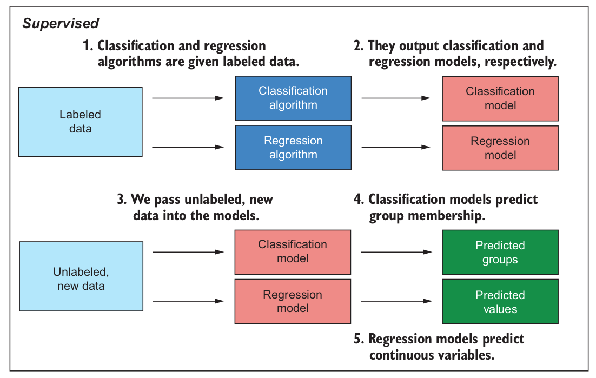
```

.footnote[<sup>*</sup> Machine Learning with R, the tidyverse and mlr]


---


## ¿Qué es EDA? `r emo::ji("mag_right")`

.bg-near-white.b--dark-blue.ba.bw2.br3.shadow-5.ph4.mt2[
### **EDA** o Análisis Exploratorio de Datos 

#### es un ciclo iterativo y un proceso creativo en donde, 

#### - **Generas preguntas acerca de tus datos.**

#### - **Buscas respuestas mediante la visualización y transformación de los mismos.**

#### - **En base a lo aprendido, refinas tus preguntas e incluso, generas nuevas.**

]
.footnote[Fuente: [R para Ciencia de  Datos](https://es.r4ds.hadley.nz/an%C3%A1lisis-exploratorio-de-datos-eda.html)]

---

## Cobran especial importancia en esta etapa


.bg-near-white.b--dark-blue.ba.bw2.br3.shadow-5.ph4.mt2[

#### Estudio de la distribución de las variables

#### Presencia de valores perdidos

#### Desbalance de las clases o grupos en estudio

#### Presencia de datos extremos o outliers 

#### Covariación de variables

]

.footnote[Fuente: [R para Ciencia de  Datos](https://es.r4ds.hadley.nz/an%C3%A1lisis-exploratorio-de-datos-eda.html)]
---
## ¿Por qué es importante el Análisis exploratorio de datos? `r emo::ji("bulb")`

.bg-near-white.b--dark-blue.ba.bw2.br3.shadow-5.ph4.mt5[

### Porque te permite conocer y entender tus datos. ]


---

# Métricas `r emo::ji("triangular_ruler")`


.bg-near-white.b--dark-blue.ba.bw2.br3.shadow-5.ph4.mt2[

### Durante el modelado de datos es probable que no hagamos un solo modelo, sino varios. 
### La manera de saber qué tan buenos son, es evaluar esos algoritmos mediante métricas.
### Tenemos métricas de regresión y clasificación.
]


---

## Métricas en la clasificación

     
  
```{r echo=FALSE, out.width = '100%',  fig.align='center'}
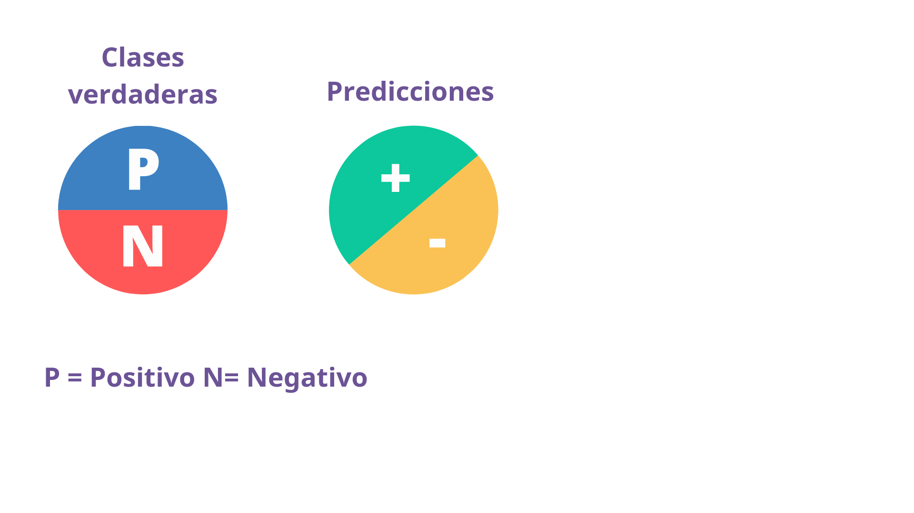
```

---

# Positivos verdaderos
     
  
```{r echo=FALSE, out.width = '100%',  fig.align='center'}
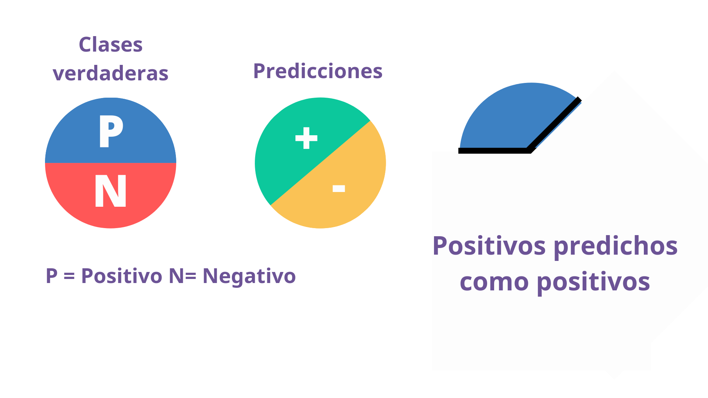
```


---

## Falsos positivos 
  
```{r echo=FALSE, out.width = '100%',  fig.align='center'}
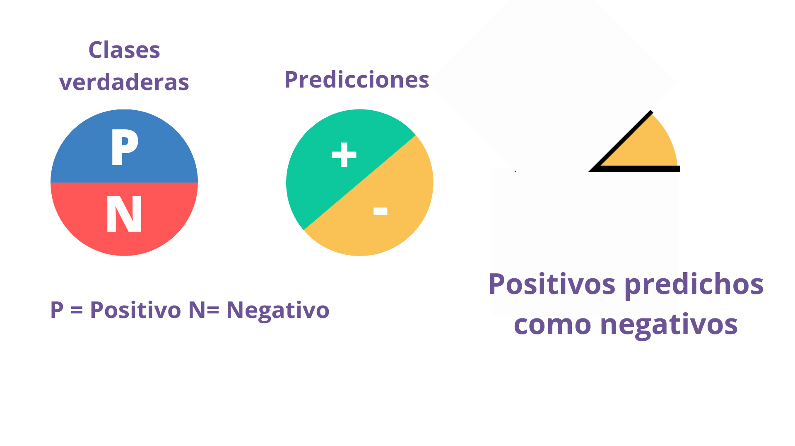
```


---

# Negativos verdaderos
  
```{r echo=FALSE, out.width = '100%',  fig.align='center'}
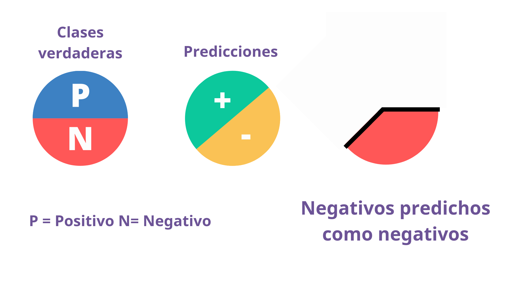
```

---

## Falsos Negativos  
  
```{r echo=FALSE, out.width = '100%',  fig.align='center'}
knitr::include_graphics("img/metricas5.png")
```


---

## Matriz de Confusión
      
  
```{r echo=FALSE, out.width = '100%',  fig.align='center'}
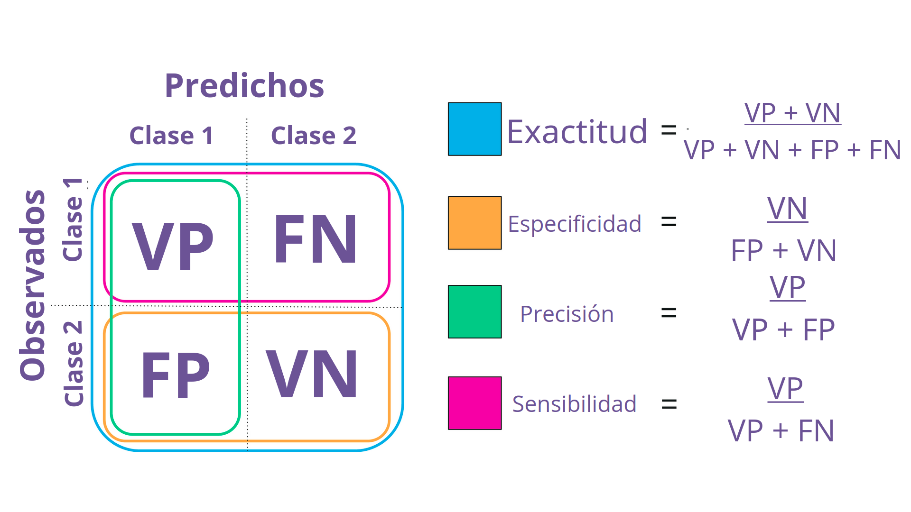
```

    


.footnote[Traducido de 10.7717/peerj.5666/fig-2]


---

## Entrenamiento, validación y testeo


```{r echo=FALSE, out.width = '40%',  fig.align='center'}
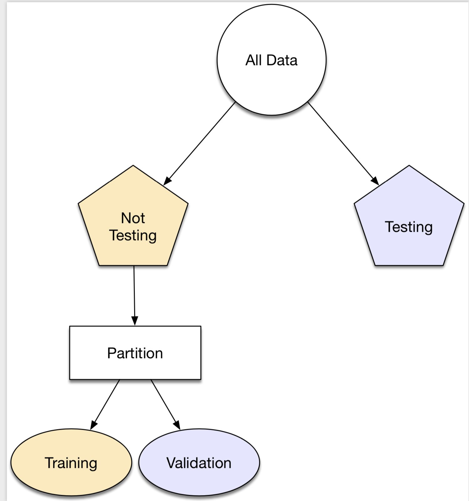
```


.footnote[Fuente: https://www.tmwr.org/resampling.html]


---

## Resampleo 

El resampleo se utiliza en ML para estimar el desempeño de un modelo. 


```{r echo=FALSE, out.width = '100%',  fig.align='center'}
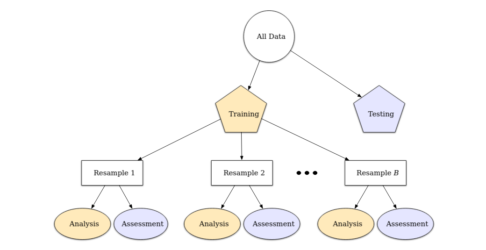
```


.footnote[Fuente: https://www.tmwr.org/resampling.html]

---


## Validación cruzada


```{r echo=FALSE, out.width = '100%',  fig.align='center'}
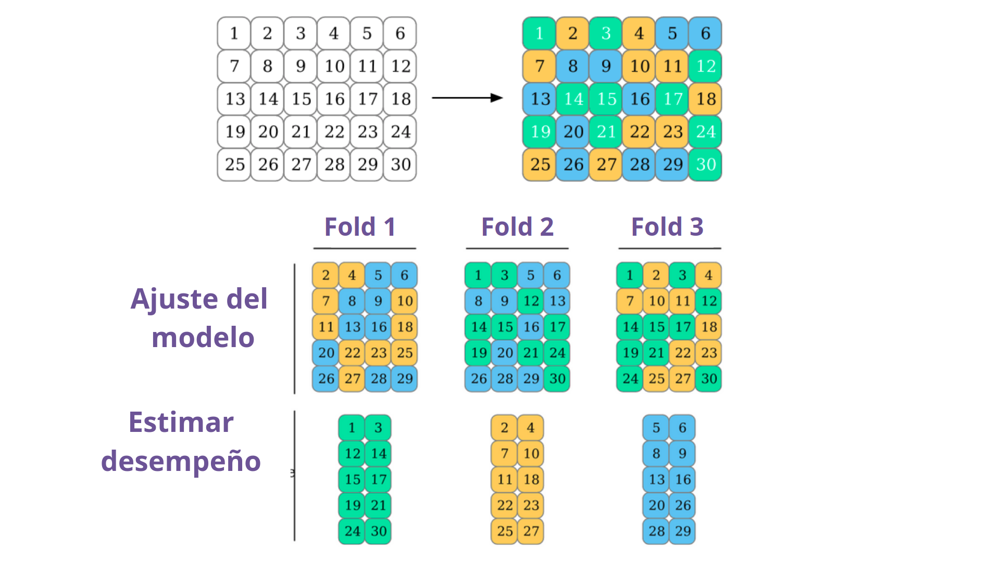
```


.footnote[Fuente: https://www.tmwr.org/resampling.html]


---
## De caret a `tidymodels`


.pull-left[
El objetivo de caret era **unificar la sintaxis** para modelizar datos usando como base distintas librerías de R. 

]

--

.pull-right[
El objetivo de Tidymodels es además hacerlo **en un formato ordenado**. 
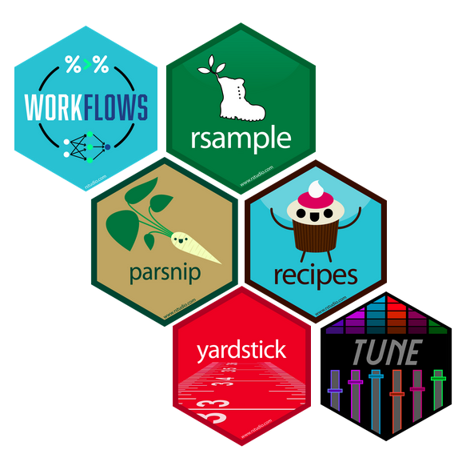

]


---
## `tidymodels`

.bg-near-white.b--purple.ba.bw2.br3.shadow-5.ph4.mt5[

### `tidymodels` es un grupo de paquetes centrado en las tareas de modelización de datos. 
### La modelización consta de varios pasos, la idea es que cada paso lo realice una librería diferente. 
]


.footnote[Sitio web: https://www.tidymodels.org/]

---

# Etapas del modelado de datos


  
```{r echo=FALSE, out.width = '100%',  fig.align='center'}
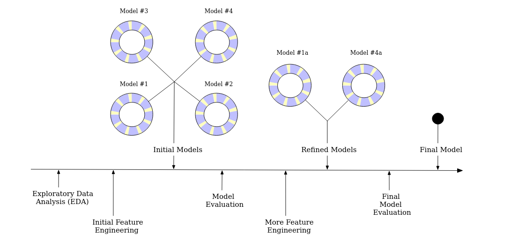
```

.footnote[Sitio web: https://www.tmwr.org/software-modeling.html]


---

## Modelado y `tidymodels`


```{r echo=FALSE, out.width = '100%',  fig.align='center'}
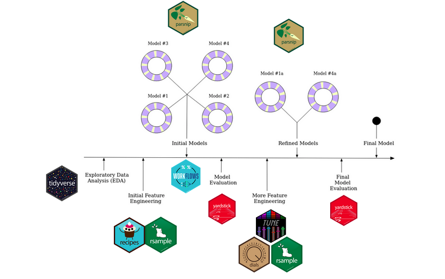
```

---

## Librerías de `tidymodels`


.left-column[
### `library(rsample)`
__Librería que nos permite hacer división del set de datos__

]

.right-column[

```{r echo=FALSE, out.width = '40%',  fig.align='center'}
knitr::include_graphics("img/rsample.png")
```

]


---

## Librerías de `tidymodels`

.left-column[
#### `library(rsample)`
### `library(recipes)`
__Permite hacer preprocesamiento de los datos__
]

.right-column[

```{r echo=FALSE, out.width = '40%',  fig.align='center'}
knitr::include_graphics("img/recipes.png")
```


]

---
## Librerías de `tidymodels`

.left-column[
#### `library(rsample)`
#### `library(recipes)`
### `library(parsnip)`
__Permite unificar los modelos a optimizar__
]

.right-column[

```{r echo=FALSE, out.width = '40%',  fig.align='center'}
knitr::include_graphics("img/parsnip.png")
```


]


---
## Librerías de `tidymodels`

.left-column[
#### `library(rsample)`
#### `library(recipes)`
#### `library(parsnip)`
### `library(workflows)`
__Nos permite unificar el flujo de trabajo__

]

.right-column[

```{r echo=FALSE, out.width = '40%',  fig.align='center'}
knitr::include_graphics("img/workflow.png")
```


]


---
## Librerías de `tidymodels`

.left-column[
#### `library(rsample)`
#### `library(recipes)`
#### `library(parsnip)`
#### `library(workflows)`
### `library(tune)`
__Permite el tuneo de los hiperparámetros de los modelos__
]

.right-column[

```{r echo=FALSE, out.width = '40%',  fig.align='center'}
knitr::include_graphics("img/tune.png")
```


]


---

## Librerías de `tidymodels`

.left-column[
#### `library(rsample)`
#### `library(recipes)`
#### `library(parsnip)`
#### `library(workflows)`
#### `library(tune)`
### `library(yardstick)`
__Permite evaluar las métricas de los modelos__
]

.right-column[

```{r echo=FALSE, out.width = '40%',  fig.align='center'}
knitr::include_graphics("img/yardstick.png")
```


]

---
